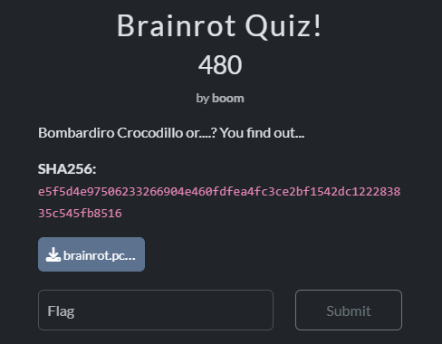
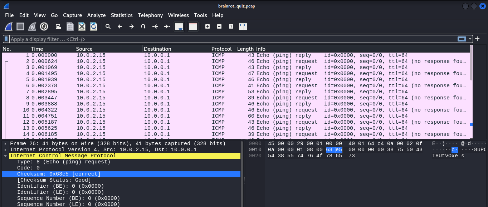
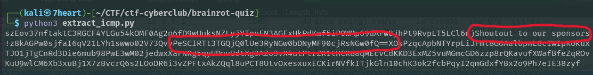
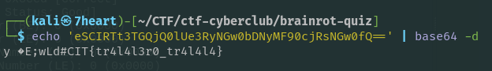

# Brainrot Quiz

## Solution


This challenge provides a pcap file for forensics.

open the pcap file using wireshark, we see that all packets sent are icmp protocol. the data sent looks like ASCII encoding.



we extract all the data using a simple python script, then we analyse it.
```c
from scapy.all import rdpcap, ICMP

packets = rdpcap('brainrot_quiz.pcap')
data = b''

for p in packets:
    if ICMP in p and p[ICMP].type in (0,8):
        if hasattr(p[ICMP], 'load'):
            data += p[ICMP].load

print(data.decode(errors='ignore'))
```

We can see that in the section that i marked there is a string `‘shootout to our sponsor’`, and after that there is also some kind of base64 encode.




I take some of the string that looks like base64, then i decode it, and I got the flag.



Flag : CIT{tr4l4l3r0_tr4l4l4}


