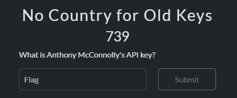
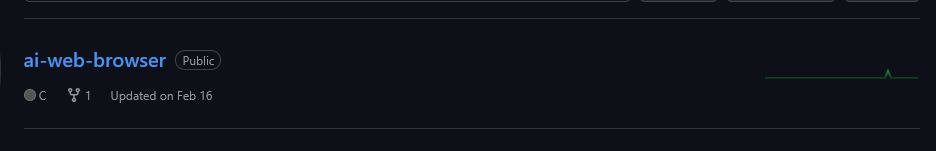
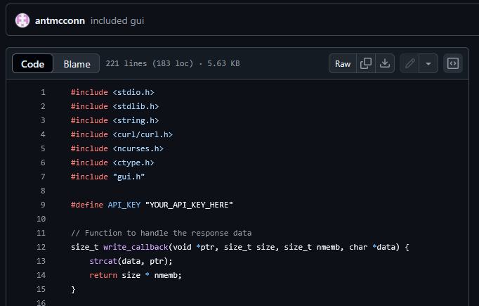

# No Country for Old Keys

## Solution

This challenge asks us to find the API key of a person named Anthony McConnolly, maybe leak API key?

first I immediately looked for the github account related to this man name, because API keys usually leak in their github repos, i got `@antmcconn` user.

I looked at the repo here ai-web-browser and there is a file with the code line `#define API_KEY “YOUR_API_KEY_HERE”`.

I checked the blame of this file and found that the API key was deleted by Anthony. 

Flag : CIT{ap9gt04qtxcqfin9}
