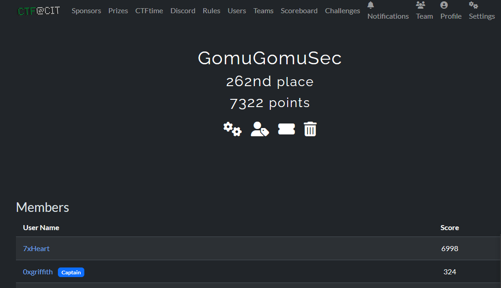

# CTF@CIT 2025

---

## REV
- [Read Only](Reverse-Engineering/ReadOnly/README.md)
- [Ask Nicely](Reverse-Engineering/AskNicely/README.md)
- [Serpent](Reverse-Engineering/Serpent/README.md)
- [Baby Keygen](Reverse-Engineering/Baby-Keygen/README.md)

## WEB
- [Breaking Authentication]([Web/Breaking Authentication/README.md](Web/Breaking%20Authentication/README.md))
- [Commit and Order Version Control]([Web/Commit and Order Version Control/README.md](Web/Commit%20and%20Order%20Version%20Control/README.md))

## Osint
- [No Country for Old Keys]([Osint/No Country for Old Keys/README.md](Osint/No%20Country%20for%20Old%20Keys/README.md))
- [Throwback to The Future]([Osint/Throwback to The Future/README.md](Osint/Throwback%20to%20The%20Future/README.md))

## Forensics
- [Brainrot Quiz]([Forensics/Brainrot Quiz.md](Forensics/Brainrot%20Quiz.md))

## Misc
- [Robots]([2025/CTF@CIT/Misc/Robots - Misc.md](Misc/Robots%20-%20Misc.md))

---
