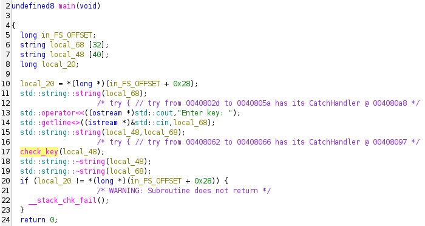
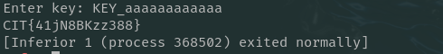

# Babykeygen - REV

## Solution

The main function reads a key from stdin and calls `check_key` on the input.


`check_key(std::string)` which aims to verify an input string given in the param_1 parameter.

```c
/* check_key(std::string) */

undefined8 check_key(string *param_1)

{
  bool bVar1;
  int iVar2;
  long lVar3;
  char *pcVar4;
  long in_FS_OFFSET;
  ulong local_50;
  string local_48 [40];
  long local_20;
  
  local_20 = *(long *)(in_FS_OFFSET + 0x28);
  lVar3 = std::string::length(param_1);
  if (lVar3 == 0x10) {
    std::string::substr((ulong)local_48,(ulong)param_1);
                    /* try { // try from 00407ee9 to 00407eed has its CatchHandler @ 00407f8e */
    bVar1 = std::operator!=(local_48,"KEY_");
    std::string::~string(local_48);
    if (!bVar1) {
      for (local_50 = 4; local_50 < 0x10; local_50 = local_50 + 1) {
        pcVar4 = (char *)std::string::operator[](param_1,local_50);
        iVar2 = isalnum((int)*pcVar4);
        if (iVar2 == 0) goto LAB_00407f7d;
      }
      std::string::string(local_48,param_1);
                    /* try { // try from 00407f67 to 00407f6b has its CatchHandler @ 00407fbc */
      validate(local_48);
      std::string::~string(local_48);
    }
  }
LAB_00407f7d:
  if (local_20 == *(long *)(in_FS_OFFSET + 0x28)) {
    return 0;
  }
                    /* WARNING: Subroutine does not return */
  __stack_chk_fail();
```
if we see function check_key the input is assumed to be 16 bytes wide. and starts with "KEY_" 

This `isalnum` function is used to check if the character accessed in `pcVar4` is any alphanumeric.
```c
iVar2 = isalnum((int)*pcVar4);
if (iVar2 == 0) goto LAB_00407f7d;
```
If the character found is not alphanumeric, the program will jump to `LAB_00407f7d`, which is likely a dead-end loop of the program.

In conclusion This function checks whether the input is exactly 16 characters, then starts with “KEY_”, and characters 5-16 are alphanumeric, if all this is met the program will give its flag.



flag : CIT{41jN8BKzz388}
