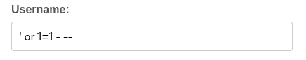
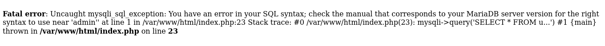

# Breaking Authentication - Web

## Solution

inject simple sqli payload `' OR 1=1 - --` in the username input on the login page.

error response indicates that the username parameter is vulnerable to sqli.

dump databases using sqlmap, then found flag.

Flag : CIT{36b0efdc2ec7132}

