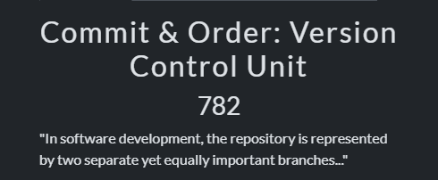
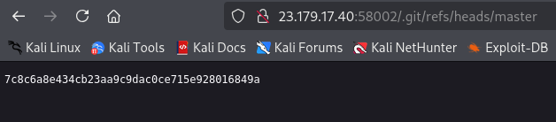
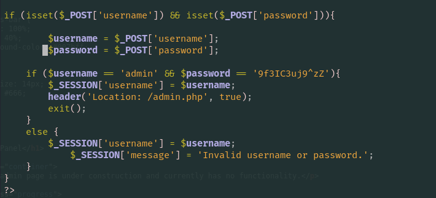
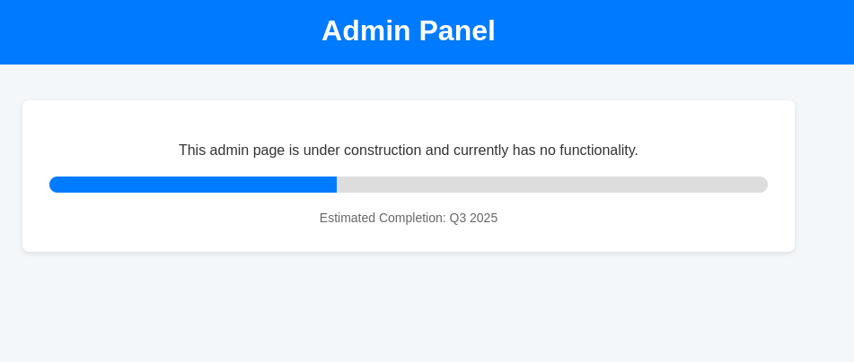
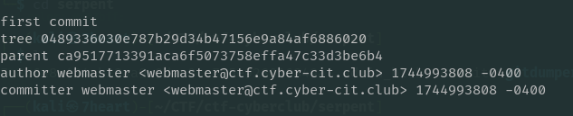
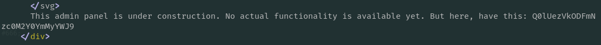
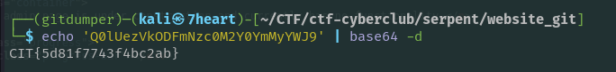

# Commit & Order: Version Control Unit - Web

## Solution


This challenge description have something to do with `git` which is often used for version control. 
Sometimes developers mistakenly make a small mistake that makes it open in the wild and we can access it through /.git/.


i brute directory path and file paths like /.git/refs/heads/master got me response 



dump it with tools like git-dumper.
```c
git-dumper <url>/.git ./output_dir
```
inspecting this repo i got 2 file: admin.php & index.php. the index.php got me a password for admin panel.





from the note in the admin panel I realized that there might be some updates and delete commits done in git during this web development. 

we can see what commits are available with:
```a
git log
```

I navigate to any of these commits to see the code,  i first inspect the first commit because I think in the first commit usually developers make a lot of small mistakes that they only realize later or put notes for what they want to work on next.



In the code in the admin.php file for the first commit there is an interesting note, and there is a base64 encode.



I eventually got the flag in base64 encoded: `Q0lUezVkODFmNzc0M2Y0YmMyYWJ9`



Flag : CIT{5d81f7743f4bc2ab}

